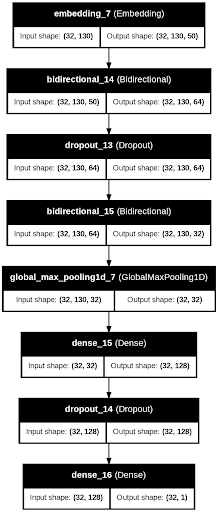

# ResolveAI: AI-Driven IT Support Ticket Resolution

ResolveAI is an AI-powered solution designed to enhance IT help desk and customer support ticket resolution by leveraging Retrieval-Augmented Generation (RAG) and deep learning-based classification. It streamlines the ticket-handling process by automating responses, reducing redundancy, and improving resolution times

## Key Features

✔️ Smart Ticket Retrieval – Uses a vector store (e.g., ChromaDB, FAISS) to retrieve relevant past resolutions.

✔️ Priority Classification – A Bidirectional LSTM model categorizes ticket priority based on both natural language and categorical features.

✔️ AI-Powered Response Generation – Combines an LLM with RAG to ensure contextual, accurate, and tailored replies.

✔️ Seamless Integration – Can be extended to work with ServiceNow, Jira Service Desk, and other ticketing platforms.

## Background

We are using the [Multilingual Customer Support Tickets](https://www.kaggle.com/datasets/tobiasbueck/multilingual-customer-support-tickets) dataset from Kaggle. This dataset provides real-world customer support requests, which makes it a strong proxy for a live system. In the event that there is a demand for additional data somewhere in the process, we may leverage InstructLab to generate high-quality synthetic support tickets and responses. In a production environment, live customer support tickets would be ingested from platforms such as ServiceNow, Jira Service Desk or other platforms.

ResolveAI incorporates multiple AI-driven components designed to optimize ticket resolution workflows. At its core, a Retrieval-Augmented Generation (RAG) component retrieves relevant past tickets or documentation from a vector store or database (e.g., Chroma, Elastic, FAISS), ensuring that responses are grounded in existing knowledge and previous resolutions.The classification component leverages a Bidirectional LSTM to  classify the priority of the ticket using a combination of natural language and categorical features. Finally, the system generates responses by integrating LLM capabilities with RAG, ensuring that answers are not only contextually accurate but also tailored to the specific needs of each ticket. This multi-layered approach enhances efficiency, minimizes manual intervention, and ultimately accelerates resolution times while maintaining high-quality support.

### Model Architecture


### System Architecture
1️⃣ Data Ingestion – Tickets are sourced from structured datasets or live systems (e.g., Jira, ServiceNow).
2️⃣ Vector Storage & Retrieval – ChromaDB/FAISS stores past resolutions for quick lookup.
3️⃣ Priority Classification – A Bidirectional LSTM model predicts ticket urgency/priority.
4️⃣ AI-Powered Response Generation – An LLM (combined with RAG) crafts intelligent responses for low priority tickets.

<!-- Installation and Running the Project -->
## Installation, Setup & Running the Project
### Prerequisites
- Python >= 3.11
- Virtual Environment Manager (Poetry Recommended)
- API Key for third-party LLM inference

### Installation
1. Clone the repository
   ```
   git clone https://github.com/kdevoe/AAI590_Customer_Support.git
    ```
   
2. Ensure the necessary packages are installed via your package manager (poetry, pip, anaconda,etc.) and import the modules into your python/notebook file. 
    ```
   pip install -r /path/to/requirements.txt 
   # OR
   poetry install 
     ```
<!-- Installation and Running the Web App -->
### Running the web application

1. Start the application with Streamlit:
   ```
   cd app
   streamlit run app.py
    ```

### 🛠️ Contribution Guidelines
✔️ Code Style: Follow PEP8 (for Python) and best practices.
✔️ Documentation: Update README or relevant docs if needed.
✔️ Discussions: Use GitHub Issues for bug reports and feature requests.

### ❓ Need Help?
Open an Issue on GitHub for any questions.

We appreciate your contributions! 🚀